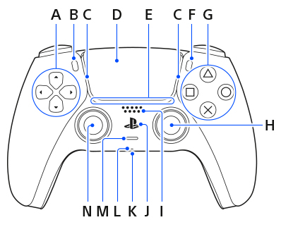

Controller Manager
==================

The CardioXplore comes with a set of predefined operations utilsing a PlayStaion 5 controller that allows the basic usage of the robot.

Front
-----

- A - Unassigned
- B - Long press with J to perform first-time pairing
- C - LED
    - Pulsing (Blue): pairing mode 
    - Solid (Blue): Connected
    - Solid (Orange): Charging
- D - Unassigned
- E - Unassigned
- F - Unassigned
- G - Unassigned (Will be used for Homing in the next generation)
- H - Right Joystick / R3
    - X movement (Left <--> Right): Tip Articulation
    - Y movement (Up <--> Down): Unassigned
    - R3: Short press to lock/unlock tip movement
- I - Unassigned
- J - Long press with B to perform first-time pairing
- K - Unassigned
- L - Unassigned
- M - Unassigned
- N - Left Joystick / L3
    - X movement (Left <--> Right): Handle Rotation
    - Y movement (Up <--> Down): Linear insertion/retraction
    - L3: Unassigned

Top
----

.. image:: images/PS5_top.png

- A - Linear Lock (Press and hold to unlock, release to lock)
- B - Unassigned
- C - Charging port (Can be used while connected to a wall power supply)
- D - Rotation Lock (Press and hold to unlock, release to lock)
- E - Unassigned
